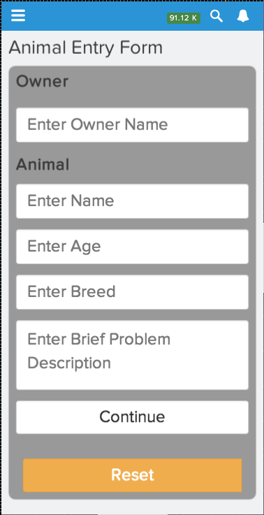
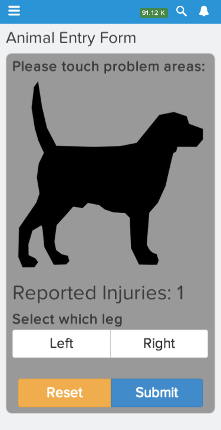
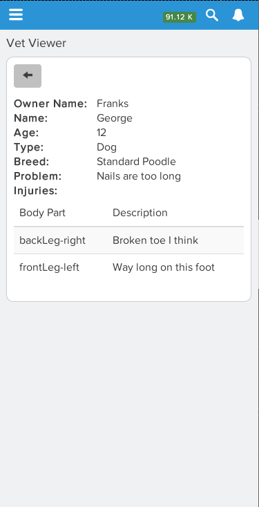

# How to Lightning - A javascript developers guide to ramping up on Salesforce Lightning Component development.

The point of this guide isn't to introduce you to lightning components or getting started with Salesforce development.  There are already great posts out there for that purpose.  I suggest reading the [Build your first lightning component tutorial] [1] and even skimming the [lightning developer guide] [2] if you need the basics.  The purpose of this post is to enable you as a javascript developer to ramp up quickly on lightning development by walking through some of the issues and solutions I found developing my first lightning component.

[1]: http://blog.jeffdouglas.com/2014/10/14/tutorial-build-your-first-lightning-component/
[2]: https://developer.salesforce.com/docs/atlas.en-us.lightning.meta/lightning/

I was introduced to Lightning components at the developers keynote at Dreamforce.  There they also announced the  [lightning.topcoder.com] [3] competition where developers could both dive into lightning component development and potentially win a some cash, a win win in my book.  The first component I built was for the 
[Lightning App - Fix My Sick Doggie! -- Redux competition] [1].  Find the resulting component and apex code in my [VetTopCoder] [2] github repository.  
	
[1]: https://www.topcoder.com/challenge-details/30046850/?type=develop  "Lightning App - Fix My Sick Doggie! -- Redux"
[2]: https://github.com/gbockus/VetTopCoder "VetTopCoder"
[3]: http://lightning.topcoder.com/ "lightning.topcoder.com"

.
.
.

## Third Party Dependancies
By day I build web application primarily using angularjs.  So my first instinct was to go with angular via CDN as a technology backing my lightning component.  However I quickly realized that lightning components do not allow you to load javascript libraries from a source outside of your salesforce domain.  In order to load a javascript file you need to upload it as a static resource.  This is done in the setup view of the salesforce.com organization. I suggest downloading the dependency you would like to use in your application and creating a zip archive including those resources. An additional requirement is that you create a package in your organization.  The package will be used to reference your static resources.  

For example I ended up using JQuery in my application (angular uses the url for routing to different views in an application and I hadn't figured how to get around that in a lightning component at the time) so I downloaded JQuery and created a zip file that contained the following files: 
- jquery.js
- jquery.min.js
- jquery.min.map

After this was uploaded I was able to verify I could access the js file by hitting it in my browser at 
```
https://na17.salesforce.com/resource/Gordonk66__jquery/jquery.jsresource/Gordonk66__jquery/jquery.js
```
Where 
  - https://na17.salesforce.com - My salesforce instance
  - Gordonk66 - My package name
  - jquery - The static resource name
  - jquery.js - The file inside my zip achieve 
  
Excellent so now I have the third party resources that I require for my application. But there is still an issue where the resource isn't loaded by the time the application renders.  Lightning components  are loaded differently then a standard web application so there has to be some addition wiring in order to load the dependancies.  After struggling for a bit I happened upon this excellent blog post that describes using requirejs to load dependancies for lightning components: 

<http://enreeco.blogspot.com/2014/10/salesforce-lightning-loading-scripts.html>

Essentially it adds a lightning component dependency to your component that will load requirejs then fire a lightning event that will trigger a controller function in your code that calls a helper function where you specify third party dependancies.  I've used this on all of my lightning components and it has worked perfectly. See the blog post for the details of getting it working, but the at a high level you add the following to your component
```
  <aura:handler event="Gordonk66:requiresReady" action="{!c.initScripts}"/>
 ```
(note you must your the installed pages or your own package)

This results in calling the controller initScripts function that calls the Helper initScripts function.  In the helper you specify your dependancies in a requirejs config object 
```javascript 
 requirejs.config({
        baseUrl: "/resource/",
        paths: {
          jquery: "/resource/Gordonk66__jquery/jquery",
          bootstrap: "/resource/Gordonk66__aotp_bootstrap/js/bootstrap",
          bootstrapValidator: "/resource/Gordonk66__bootstrapvalidator/bootstrapvalidator/dist/js/bootstrapValidator"
        },
        shim: {
          bootstrap: {deps: ["jquery"]},
          bootstrapValidator: {deps: ["jquery"]}
        }
```        
        
After the scripts have loaded the function is called again in the afterRender function of your component renderer and any follow on setup, like binding to DOM elements, can occur.  See one of the Helpers in the VetTopCoder repository for a working example. 


## Useful Lightning/Aura Element Attributes

While you are able to use standard web application tools to build the lightning component there are several useful aura/lightning element attributes that can enable your application to wire together the lightning component.  Note there are many more then I've listed here, but these are the ones I've found most useful.

### aura:id 
The id tag enables you to assign a unique id to elements in your lightning component.  This is useful because you are able to do DOM lookups using the component.get('myId') function that will ensure a unique id for your component.  Keep in mind you could have multiple instances of you lightning component in a single application and using this tag will ensure there are no duplication id attributes on your DOM elements. 

### aura:attribute
The attribute tag is how you can define salesforce data to be stored for the component.  It has been very useful to use the lightning infrastructure to call an apex controller that will populate an aura attribute.  Then firing a lightning event enables me to continue processing the data in my application with the third party library handlers.  

### aura:handler 
This tag wires a handler function in your lightning controller to lightning events.  This is useful because it enables you to do data lookups and have access to a current component object when  processing data returned from a salesforce apex controller. 

### aura:iterator
This tag enables you to iterate over an aura:attribute that is a list and display data associated with that data in the DOM.  It's a nice real time update to the page without having to build out the DOM via javascript.

## Developer Tools 
One thing I struggled with initially was doing all my development in the browser via the Salesforce developer console.  I prefer a more configurable IDE when doing development.  Luckily I happened upon the Sublime text plugin for lighting development: 
	
https://github.com/dcarroll/sublime-lightning
	
It enables login to salesforce inside the sublime text and creates or edits lightning components.  It will then sync changes back to salesforce on save.  It displays an error message if there is a syntax or formatting problem when syncing with Salesforce.  

This was a huge development boost for me and I have nothing but good things to say about it.  You will need to do your apex code development in the developer console, but with the automatic validation and apex being a fairly small portion of your code base  for lightning components it isn't bad. 

So there you have it.  As a javascript developer you're now ready to hit the ground running developer lightning components.

